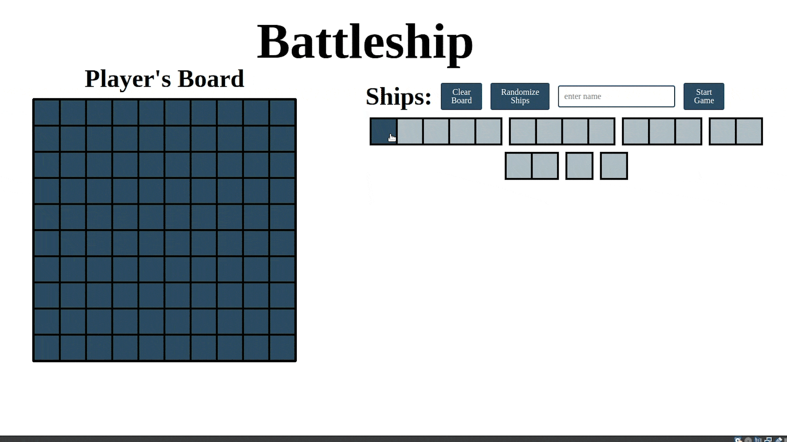
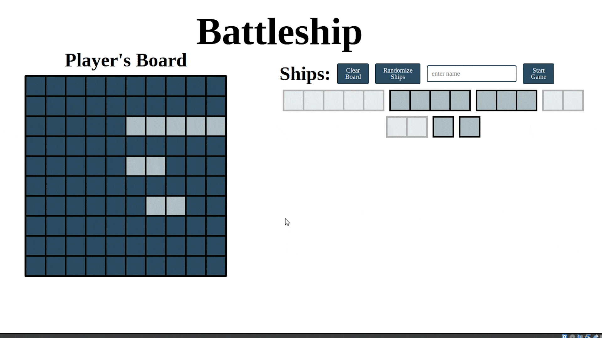
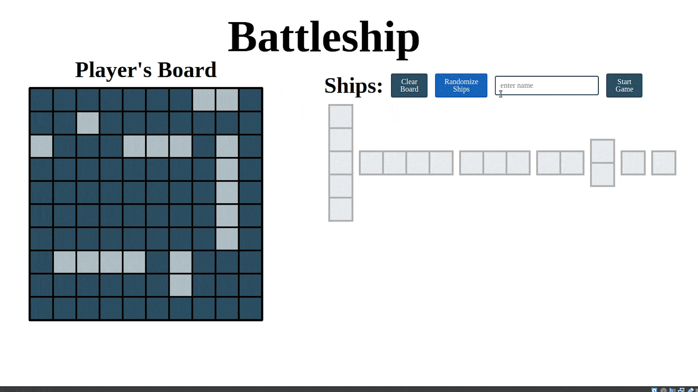
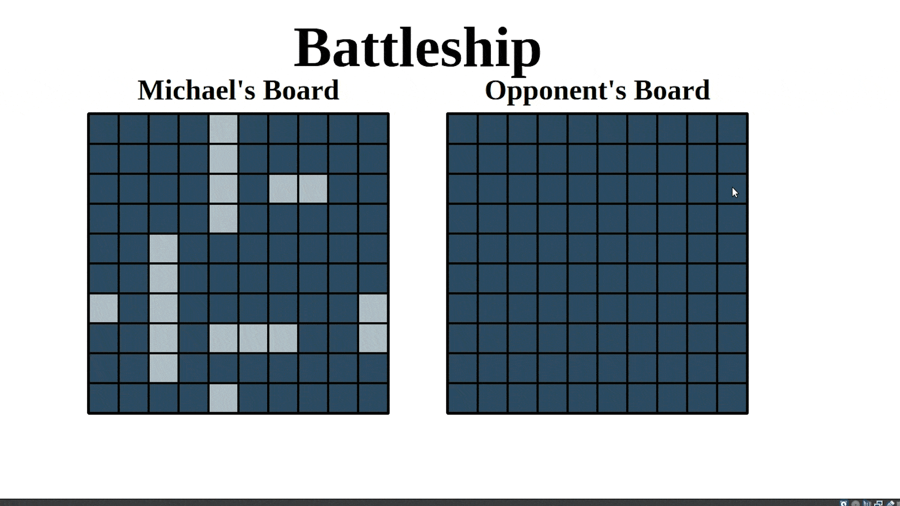

# Battleship

A live demo of the game can be found[here](https://zando411.github.io/Battleship/)

## How to Play

To start, place your ships onto your board however you like by clicking to rotate and dragging them into place.

|  |  |
|:--:|:--:|
| *gif of ship being clicked and rotated* | *gif of ship being dragged in place* |

or, for quick setup press the randomize button.

Enter your name into the box, and press start!

You will then be paired against an AI opponent until one player wins!

Then you can replay as many times as you wish by replacing your ships and starting again!

## What I learned

1. Basics of Jest
1. Developing with Test Driven Development
1. Using Factory Functions
1. Deploying projects to Github Pages
1. Using Webpack for bundling and compiling
